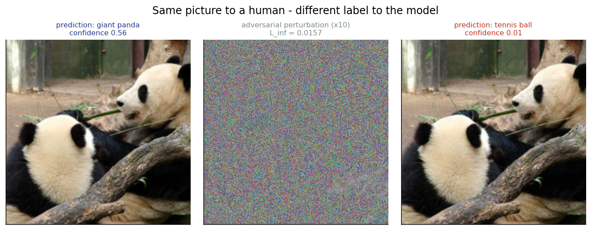
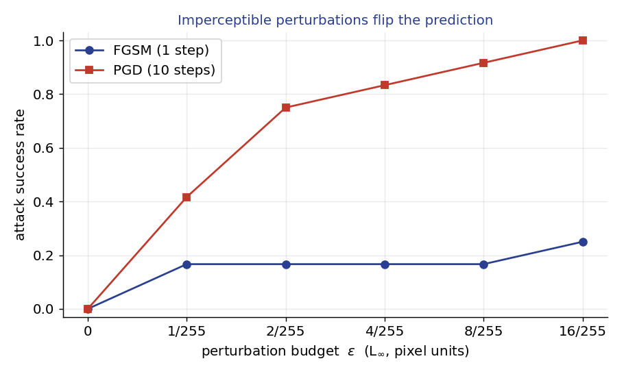
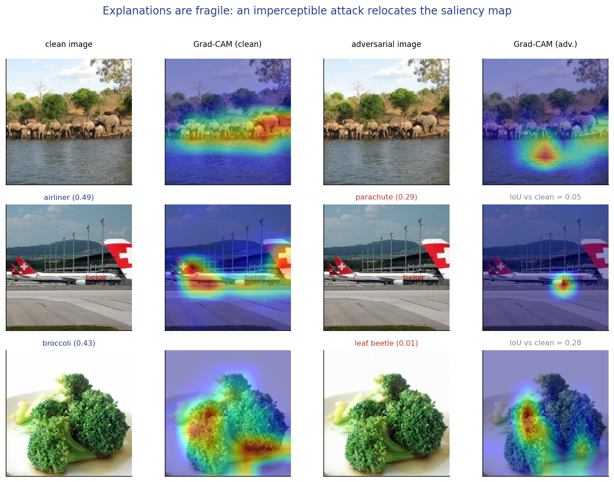
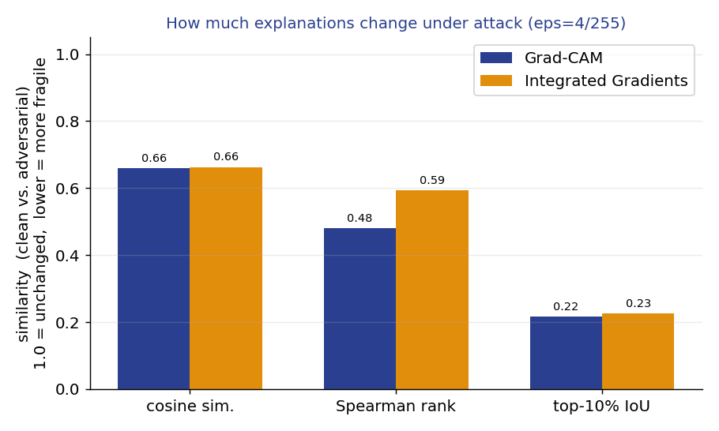
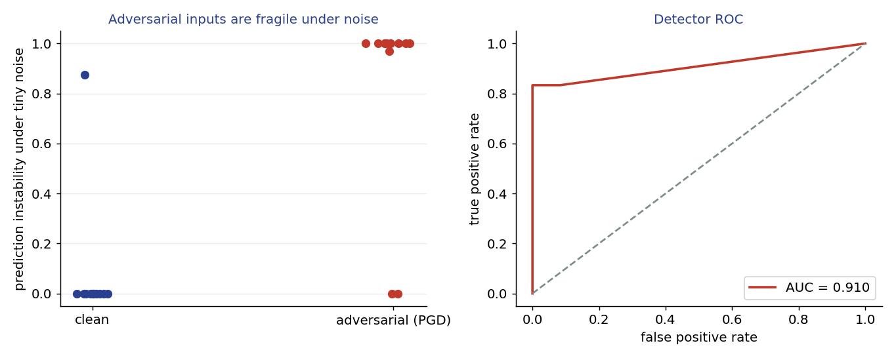

# Do Explanations Survive Attacks?
### Adversarial Robustness of Saliency-Based Interpretability

**Mini Research Problem (MRP) — AI Introductory Course, Sofia University**
Author: **Jagrat Shrivastav** · Instructor: Aleksandr Petiushko

A self-contained study that **bridges two course lectures** — *Lecture 07 (Robustness / adversarial attacks)* and *Lecture 09 (Interpretability / explainability)* — and asks a single question:

> When an imperceptible adversarial perturbation fools an image classifier, what happens to the **explanation** of its decision — and can the explanation's own fragility be used to **detect** the attack?

🖥️ **Slide deck (live):** **https://jagrat97.github.io/adversarial-attacks-vs-explanations/** · 📄 **PDF:** [`slides.pdf`](slides.pdf) · 🎥 **Demo video:** **https://youtu.be/lAmMayGBdh4** · 🧪 **Reproduce:** `python src/run_experiments.py`

> The deck is a single self-contained `index.html` (custom slide engine — arrow keys to navigate, `F` for fullscreen). Open it locally or use the live link above.

---

## TL;DR

Using a pretrained **ResNet-50** on 12 ImageNet images, all on a laptop (~40 s, no GPU):

| Question | Finding |
|---|---|
| **Do attacks succeed?** | **PGD** flips up to **100%** of predictions; FGSM is far weaker. The L∞ budget is invisible to the eye. |
| **Do explanations survive?** | **No.** Only **~22%** of the top-salient region survives the attack (Grad-CAM top‑10% IoU **0.22**, Integrated Gradients **0.23**). |
| **Can fragility reveal attacks?** | **Yes (partly).** A noise-instability detector separates clean vs. adversarial inputs with **ROC‑AUC 0.91**. |



*Same picture to a human, a different label to the model: an imperceptible perturbation (centre, amplified ×10) turns "giant panda" into a completely different class.*

---

## Why this matters

Saliency explanations (Grad-CAM, Integrated Gradients) are increasingly shipped alongside models to *justify* decisions in high-stakes settings (medicine, autonomous driving — see Lecture 08). If a perturbation a human cannot see can silently **flip the prediction and relocate the explanation**, then the explanation is unreliable exactly when scrutiny matters most. This MRP measures that effect and tests a simple defense.

## Method

* **Model** — `torchvision` ResNet-50 (`IMAGENET1K_V2`). Normalization is folded into the model so attacks/explanations operate in `[0,1]` pixel space and the budget `ε` is expressed directly in `k/255`.
* **Attacks (from scratch, PyTorch)** — untargeted **FGSM** (one step) and **L∞ PGD** (iterative), pushing the model away from its own clean prediction. See [`src/attacks.py`](src/attacks.py).
* **Explanations** — **Grad-CAM** implemented from scratch with forward/backward hooks on `layer4`, plus **Integrated Gradients** via [Captum](https://captum.ai/) (the library used by the course's reference ViT-interpretability project). See [`src/explain.py`](src/explain.py).
* **Explanation shift** — cosine similarity, Spearman rank correlation, and **top‑10% region IoU** between the clean and adversarial saliency maps for the *same* target class. See [`src/metrics.py`](src/metrics.py).
* **Detector** — *prediction instability*: the fraction of tiny Gaussian-noised copies of an input whose predicted label changes. Adversarial inputs sit near a decision boundary, so they are unstable; clean inputs are not. Scored with ROC‑AUC. Forward-only, no training.

## Results

### A — Imperceptible perturbations flip the prediction


PGD reaches **100%** success at ε = 16/255 and **83%** at ε = 4/255; single-step FGSM plateaus near 17%. ε = 0 gives 0% (sanity check).

### B — Explanations are fragile



At ε = 4/255 (10/12 predictions flipped), the most-salient region barely overlaps before vs. after the attack — **Grad-CAM IoU 0.22, IG IoU 0.23**. The heatmap moves off the object even though the image looks unchanged. This reproduces, on a modern classifier, the effect reported by Ghorbani et al. (2019), *"Interpretation of Neural Networks is Fragile."*

### C — That fragility detects the attack


Clean inputs are stable under tiny noise (mean instability **0.07**); adversarial inputs are not (**0.83**). A single-feature detector separates them with **ROC‑AUC 0.91**.

## Reproduce

```bash
python3 -m venv .venv && source .venv/bin/activate
pip install -r requirements.txt

python src/fetch_images.py        # download the 12 sample images (one-time)
python src/run_experiments.py     # -> figures/*.png + results/results.json

# the slide deck is index.html — open it in any browser (or use the live link above)
open index.html                   # macOS;  or just double-click it

# Interactive single-image demo (used in the video):
python src/demo.py --image giant_panda --attack pgd --eps 4/255
python src/demo.py --image zebra       --attack pgd --eps 8/255
```

Runs on CPU, CUDA, or Apple-Silicon **MPS** (auto-detected).

## Repository layout

```
index.html            the ~10-minute slide deck (open in a browser / hosted on Pages)
src/
  data.py             model + image loading ([0,1] space, ImageNet labels)
  attacks.py          FGSM + PGD (from scratch)
  explain.py          Grad-CAM (from scratch) + Integrated Gradients (Captum)
  metrics.py          explanation-shift metrics + instability detector + AUC
  run_experiments.py  the full study -> figures/ + results/results.json
  demo.py             single-image live demo (attack + explanation + verdict)
  fetch_images.py     downloads the sample images
images/               12 ImageNet sample images (+ labels.json)
figures/              generated result figures (used by the deck + this README)
results/results.json  all numbers behind the figures/slides
DEMO_SCRIPT.md        narration script for the recorded demo
```

## Limitations

Small sample (12 images, one architecture); white-box, L∞ attacks only; the detector is non-adaptive. As Carlini & Wagner (2017) showed, an adversary aware of a detector can often bypass it — so this is a **hurdle, not a cure**.

## References

* Szegedy et al. (2014), *Intriguing properties of neural networks*, [arXiv:1312.6199](https://arxiv.org/abs/1312.6199)
* Goodfellow, Shlens, Szegedy (2015), *Explaining and Harnessing Adversarial Examples* (FGSM), [arXiv:1412.6572](https://arxiv.org/abs/1412.6572)
* Madry et al. (2018), *Towards Deep Learning Models Resistant to Adversarial Attacks* (PGD), [arXiv:1706.06083](https://arxiv.org/abs/1706.06083)
* Selvaraju et al. (2017), *Grad-CAM*, [arXiv:1610.02391](https://arxiv.org/abs/1610.02391)
* Sundararajan, Taly, Yan (2017), *Axiomatic Attribution for Deep Networks* (Integrated Gradients), [arXiv:1703.01365](https://arxiv.org/abs/1703.01365)
* Ghorbani, Abid, Zou (2019), *Interpretation of Neural Networks is Fragile*, [arXiv:1710.10547](https://arxiv.org/abs/1710.10547)
* Kindermans et al. (2019), *The (Un)reliability of saliency methods*, [arXiv:1711.00867](https://arxiv.org/abs/1711.00867)
* Feinman et al. (2017), *Detecting Adversarial Samples from Artifacts*, [arXiv:1703.00410](https://arxiv.org/abs/1703.00410)
* Xu, Evans, Qi (2018), *Feature Squeezing*, [arXiv:1704.01155](https://arxiv.org/abs/1704.01155)
* Carlini & Wagner (2017), *Adversarial Examples Are Not Easily Detected*, [arXiv:1705.07263](https://arxiv.org/abs/1705.07263)

**Course:** [github.com/fatheral/ai-intro-course](https://github.com/fatheral/ai-intro-course) — Lecture 07 (Robustness), Lecture 09 (Interpretability & Explainability).
**Data:** sample images from [EliSchwartz/imagenet-sample-images](https://github.com/EliSchwartz/imagenet-sample-images).
**Deck design** follows Anthropic's [frontend-design skill](https://github.com/anthropics/skills/tree/main/skills/frontend-design).
